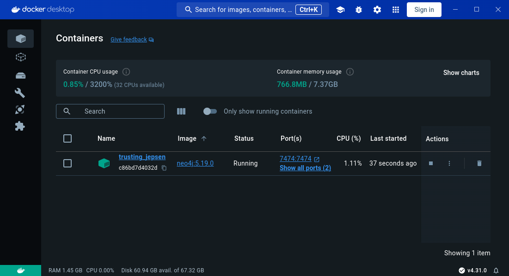

# DB2 - (Group 4) Kim Heesung & Emanuel Borges

## Introduction

This project's aim is the following:

1. Devise a database in which to organize the data given by the file "taxonomy_iw.csv", effectively mimicking [Wikipedia](https://www.wikipedia.org/)'s articles' hierarchical taxonomy at a given point in time.

2. Implement it using Neo4j.

3. Develop a Command Line Interface (CLI) to facilitate interaction with the database, adhering to a predetermined set of functionalities. The CLI will enable users to perform specified tasks, such as data retrieval and manipulation, through the issuance of commands.

## Choice of technology

#### [JavaScript](https://developer.mozilla.org/en-US/docs/Web/JavaScript)

The programming language used for developing the CLI application. It is utilized within the Node.js environment to write the logic, functionality, and behavior of the CLI.

#### [**Node.js**](https://nodejs.org/en)

The [runtime environment](https://stackoverflow.com/questions/3900549/what-is-runtime) that allows JavaScript code to be executed outside of a web browser. In this project, it is used to run the code in the user's local machine.

#### [**npm**](https://www.npmjs.com/)

A package manager for Node.js used for installing, sharing, and managing dependencies for Node.js projects. It gathers all the project's dependencies, including their own dependencies, into a cohesive and executable application, ensuring everything works seamlessly together.

#### [**Docker**](https://www.docker.com/)

A platform for [containerizing](https://aws.amazon.com/what-is/containerization/) applications. We used Docker to instantiate the database, eliminating the need for users to set it up themselves or worry about port configurations. Furthermore, although our application currently runs exclusively on Unix-like operating systems, thanks to Docker our codebase is made robust enough to need nothing but trivial modifications to achieve broad compatibility across different operational systems.

#### [**Neo4j**](https://neo4j.com/)

The chosen database management system for storing and managing data. Given that the relevant data can be adequately conceptualized as consisting entirely of point-like nodes, and that each pair of nodes is connected by not more than one directed ridge, we decided that Neo4j – being a [graph database](https://neo4j.com/docs/getting-started/get-started-with-neo4j/graph-database/) system – would most efficiently suit our needs.

#### [**Yargs**](https://yargs.js.org/)

A library for building interactive command line tools in JavaScript. It is used in this project to parse arguments and manage the command structure for the CLI, providing a standardized way to handle user input and execute commands.

## Software Architecture

This application works by instantiating a Neo4j database within a Docker [container](https://docs.docker.com/guides/docker-concepts/the-basics/what-is-a-container/), which will be responsible for exposing the ports necessary to connect to our database. Once such a port has been exposed by the docker container, we can connect to it by means of the [Neo4j Driver for JavaScript](https://www.npmjs.com/package/neo4j-driver) to run queries and perform operations in our Neo4j database.

All interactions with the database, including setup, are managed through a Command Line Interface (CLI) built in JavaScript using yargs. When the CLI is invoked, yargs works in the background to parse the received arguments and execute their corresponding commands, handling errors and providing instructions to the user whenever necessary.

It is important to note that for each command issued, the Neo4j Driver attempts to establish a connection to the database, execute the relevant queries, and then close the connection. For this reason, **as long as there is an online database configured to work with the CLI** (through means of the `dbcli` command), **the application will do its job**, regardless of how this database was brought online. The importance of such a remark will come to light in the [user manual](#user-manual) section of these docs.

## Prerequisites

1. [Node.js](https://nodejs.org/en/download)

   - Minimum required version: 18
   - Recommended version: Latest stable release
   - Version used during development: 20.9.0

2. [Docker Engine](https://docs.docker.com/engine/install/)

   - Minimum required version: 19.03
   - Recommended version: Latest stable release
   - Version used during development: 26.1.4

3. [Docker Desktop](https://docs.docker.com/desktop/install/linux-install/)
   - Minimum required version: 2.1.0.0
   - Recommended version: Latest stable release
   - Version used during development: 4.30.0

## Installation and setup instructions

1. Install prerequisites.

2. Download this repository into your local machine.

3. Navigate to the repository's `dbcli` directory.

4. Install the necessary dependencies:

   ```
   npm install
   ```

5. Once you find yourself in the `dbcli` directory, you can execute the application with [npx](https://stackoverflow.com/questions/50605219/difference-between-npx-and-npm):

   ```
   npx dbcli
   ```

6. **(Optional)** Additionally, this CLI can be made globally available in your local machine, and thus interacted with regardless of where in the operating system's folder structure you issue its commands.
   For that, you must create a symbolic link from npm's [global Node modules](https://stackoverflow.com/questions/5926672/where-does-npm-install-packages) to the current package's local modules' directory. Still in the `dbcli` directory, you must execute the following command:

   ```
   npm link
   ```

   And from there onwards, npx can be dispensed with entirely:

   ```
    dbcli
   ```

   This should take care of making the package globally available while dispensing with the need to actually globally install it. This makes cleanup job much easier once we are done with using the application, as it is enough to simply navigate back to the `dbcli` directory and run:

   ```
   sudo npm rm --global dbcli
   ```

## User manual

### Ensure connection to the database

Before any commands can be run, an active instance of a Neo4j database needs to be running in the background. Since it can easily be overwhelming to deal with database authentication, ports mapping and their connectivity, we have built a command that takes care of instantiating the database with the proper authentication settings in a Docker container and expose its ports for subsequent connectivity.

In order to connect to the database, first **make sure to be running Docker Desktop in the background.** Then, run:

```
$ dbcli connect
```

This should take care of establishing a working connection to the database for as long as the terminal window wherein it was run is kept operational.

In short, this command tells Docker to create a container with a properly configured Neo4j database and bring it online, allowing the CLI to connect to it via the Neo4j Javascript Driver. You can keep tabs on the current state of your containers through the Docker Desktop application. This is how a newly-established database connection looks like in Docker Desktop:



Further invocations of this same command will create, each time, a new container, regardless of whether they have been successful or not. Therefore, **be sure to note the names given to any containers you would like to keep track of**, as they can easily get lost amidst a containers' sea if not properly managed.

As soon as the terminal window on which the `connect` command was run is closed, so is our connection to the database. To bring it back online, you can either:

1. **Manually restart the container through the Docker Desktop application**, by pressing on the play button under the "Actions" column.

2. **Connect to a new database through the CLI application**, by running the `connect` command once again.

### Loading the CSV file into your database

To load the CSV file into the database, **make sure that the file is placed in the _import_ directory within the _dbcli_ folder**. This requirement arises due to both [Neo4j's](https://neo4j.com/docs/getting-started/data-import/csv-import/) and [Docker's](https://docs.docker.com/desktop/settings/mac/#file-sharing) settings. In short, both systems restrict their file access to specific directories to optimize resource usage. Violating this constraint can lead to significant performance issues.

After placing the file in the correct directory and ensuring there is an active database connection, execute the following command:

```
$ dbcli load <file_name>
```

Please note that, since imports can only be carried out in this specific folder, regardless of where the command is being run, `<file_name>` stands for the name of the file (or their path) **inside the import directory**. Furthermore, given the project's aims, **CSV files should have exactly two columns per row,** and any other amount may result in unexpected processing errors.

### Interacting with the database

The interaction with the database is achieved by means of the command line interface invoked by the `dbcli` call, and its usage is governed by the following syntax:

```
$ dbcli <command> <args...>
```

The list of all available commands and their aliases can be retrieved by running the `--help` command:

```
$ dbcli --help
```

Additionally, the CLI comes fully equipped with `--help` options for every command:

```
$ dbcli 12 --help
dbcli 12 <node_1> <node_2>

Finds all paths between two given nodes, with directed edges from the first to
the second node.

Positionals:
  <node_name>  Specifies the current name of the node you intend to rename.
                                                                        [string]
  <new_name>   Specifies the new name you wish to assign to the node.   [string]

Options:
  --help   Show help                                                   [boolean]
```

For some commands, additional options are available:

```
$ dbcli 8 --help
dbcli 8

Finds a root node (i.e., one which is not a subcategory of any other node).

Options:
  --help    Show help                                                  [boolean]
  --amount  Specifies the amount of root nodes you would like to return.
                                                                    [default: 1]
```

To make use of them, the following syntax is necessary:

```
$ dbcli <command> --<option>=<value>
```

For the above example:

```
$ dbcli 8 --amount=2
List of 2 randomly selected root node(s):

[ Ray_Charles, Lavrio_B.C. ]

Execution time: 0.8191 seconds
```

## Database design and its implementation

### The design

The design of the database is very simple, and further insight can be gained on it by reading the Cypher Queries used to load the data from the CSV file into the database. These queries can be found in the _queries_ directory, specifically queries `loadCategoriesQuery` and `loadRelationshipsQuery` from the file _uploadQueries.js_. For conciseness' sake, they will not be reproduced in full here.

In summary, as previously stated, it consists entirely of **nodes connected by a single directed ridge.** Each node represents an article in Wikipedia, and all the nodes to which it connects represent a "subarticle", so to speak, that is: an article to which it links.

This effectively mimicks Wikipedia's articles' taxonomy at a given point in time, with broader and more general articles encompassing and nesting narrower and more specialized articles, as can be seen [in the examples below](#results).

### The implementation

To implement such data structure, the target CSV file is loaded into the database in three steps:

1.  First, a uniqueness constraint is set up on the nodes' name property, to ensure that no two nodes can carry the same name.

2.  Then, all nodes are loaded into the database via [Cypher's](https://neo4j.com/docs/cypher-manual/current/introduction/) `LOAD CSV` command.

3.  Finally, all of their relationships are loaded also through means of the `LOAD CSV` command.

Such a strategy was taken from the [Neo4j Docs' recommendations for optimizing CSV data imports](https://neo4j.com/docs/getting-started/data-import/csv-import/#optimizing-load-csv) and coupled with transactions' batching to ensure the proper loading of such large amount of data.

### The final result

After loading all CSV data into the database, we are left with a database whose nodes (and their relationships) can be represented as follows:

```
(parent_node:Category {name: "Article"})-[:HAS_SUBCATEGORY]->(child_node:Category {name: "Subarticle"})
```

Which can be read as follows: _"A parent node of the type Category whose name is Article has a child node of the type Category whose name is Subarticle."_

All queries to the database are done using [Cypher](https://neo4j.com/docs/getting-started/cypher-intro/), and can be found in `./dbcli/queries/cypherQueries.js`

## Results

#### Setting up of the database:

Loading the data from the CSV file into the database.

```
$ dbcli load taxonomy_iw.csv
✔ Nodes loaded successfully.
✔ Relationships loaded successfully.
✔ Database has been successfully filled with data from the CSV file.

Elapsed time: 04m 43s 728ms
```

#### Task 01

Finding all children of a given node:

```
$ dbcli 1 Engineering_universities_and_colleges_in_Poland
All children of the node "Engineering_universities_and_colleges_in_Poland":

[
  AGH_University_of_Science_and_Technology,
  Szczecin_University_of_Technology,
  Wrocław_University_of_Science_and_Technology,
  Łódź_University_of_Technology
]

Execution time: 0.0184 seconds
```

---

#### Task 02

Counting all children of a given node:

```
dbcli 2 Engineering_universities_and_colleges_in_Poland
The amount of children of the node "Engineering_universities_and_colleges_in_Poland" is:
4

Execution time: 0.0495 seconds
```

---

#### Task 03

Finding all grandchildren of a given node:

```
$ dbcli 3 Presidents_of_Belarus
All grandchildren of the node "Presidents_of_Belarus":

[ Lukashenko_family ]

Execution time: 0.0158 seconds
```

---

#### Task 04

Finding all parents of a given node:

```
$ dbcli 4 Tourism_in_South_Korea
All parents of the node "Tourism_in_South_Korea":

[
  Service_industries_in_South_Korea,
  Tourism_by_country,
  Tourism_in_Asia_by_country,
  Tourism_in_Korea
]

Execution time: 0.0161 seconds
```

---

#### Task 05

Counting all parents of a given node:

```
$ dbcli 5 Tourism_in_South_Korea
The amount of parents of the node "Tourism_in_South_Korea" is:
4

Execution time: 0.0353 seconds
```

---

#### Task 06

Finding all grandparents of a given node:

```
$ dbcli 6 Tourism_in_South_Korea
All grandparents of the node "Tourism_in_South_Korea":

[
  Industry_in_South_Korea,
  Leisure_by_country,
  Service_industries_by_country,
  Service_industries_by_country,
  Service_industries_in_Asia_by_country,
  Service_industries_in_Asia_by_country,
  Service_industries_in_Korea,
  Tourism,
  Tourism_in_Asia,
  Tourism_in_Asia
]

Execution time: 0.0367 seconds
```

---

#### Task 07

Counting how many uniquely named nodes there are:

```
$ dbcli 7
The amount of uniquely named nodes is:
2031337

Execution time: 0.3419 seconds
```

---

#### Task 08

Finding a root node (i.e., one which is not a subcategory of any other node):

```
$ dbcli 8
List of 1 randomly selected root node(s):

[ Pope_Urban_II ]

Execution time: 0.7335 seconds
```

---

#### Task 09

Finding the node(s) with the most children (there could be more than one, if they are tied for the first place):

```
$ dbcli 9
✔ Query completed.

Nodes with the highest amount of children:

[ Albums_by_artist ]

Execution time: 3.1954 seconds
```

---

#### Task 10

Finding the node(s) with the least amount of children, excluding entirely childless nodes:

```
$ dbcli 10

[
    Suhut District,
    Sar Mountains,
    Savnik_Municipality,
    sid,
    silute,
    Suto orizari Municipality,
    ZorY,
    ...
]

Elapsed time : 4.3682s
```

---

#### Task 11

Renaming a given node:

```
$ dbcli 11 Leonardo_da_Vinci Kim_Heesung
✔ Successfuly renamed the node Leonardo_da_Vinci to Kim_Heesung

Execution time: 0.0701 seconds
```

---

#### Task 12

Finding all paths between two given nodes, with directed edge from the first to the second node:

```
$ dbcli 12 15th-century_Italian_painters Paintings_by_Leonardo_da_Vinci
✔ Query completed.

All paths between nodes "15th-century_Italian_painters" and "Paintings_by_Leonardo_da_Vinci" (up to 15 levels deep):

15th-century_Italian_painters
 →  Kim_Heesung
 →  Works_by_Leonardo_da_Vinci
 →  Paintings_by_Leonardo_da_Vinci (depth: 3)

15th-century_Italian_painters
 →  Italian_Renaissance_painters
 →  Kim_Heesung
 →  Works_by_Leonardo_da_Vinci
 →  Paintings_by_Leonardo_da_Vinci (depth: 4)

Execution time: 1.3789 seconds
```

---

### System Environment Specifications

The above execution times are the result of running the corresponding queries on the following system:

- CPU Information

  - Model: 13th Gen Intel(R) Core(TM) i9-13900HX
  - Total Logical Processors: 32
  - Cores: 24
  - Threads per Core: 2
  - Max Frequency: 5400 MHz
  - Cache:
    - L1d: 896 KiB (24 instances)
    - L1i: 1.3 MiB (24 instances)
    - L2: 32 MiB (12 instances)
    - L3: 36 MiB (1 instance)

- Memory Information

  - Total Memory: 32 GB

- Disk Space

  - Main Filesystem: 450 GB total, 120 GB available

## Project evaluation

This project was developed alongisde a competing alternative in MongoDB. Our goal was to implement the very same project in at least two different widely used database technologies to compare their performances and opt for the more efficient alternative. Hence, the evaluation here presented takes into account not only our expectations as to how our database should perform, but also how other implementations of different database management systems have proven to perform.

- ### Data Loading Efficiency

  By employing the [aforementioned strategies](#the-implementation) for efficient data loading, for the [system specified above](#system-environment-specifications), the loading of approximately 2 million nodes and 5.8 million relationships was accomplished in under 5 minutes. **We consider this to be quite fast**, and beats our MongoDB implementation by about 2 minutes, even though MongoDB is usually considered to be faster. Although we were certain that the traversal of nodes would prove significantly faster in Neo4j, we were positively surprised to see that the importing process was also more efficient. **We attribute this to the simplicity of each node's data** (their name and category type only), for given that different DBMSes have different conditions under which they perform the best, it seems like a natural conclusion that they would also have an easier time parsing and processing data in the format they can manage best. Therefore, since MongoDB excels in processing richly structured document-like data while Neo4j's forte is in the traversal of highly interconnected (but comparatively simpler) data, **we find that the positively surprising data loading efficiency might be a fortunate consequence of the right DBMS choice for the project.**

- ### Data Processing Efficiency

  Given that most queries run in less than a second, we also find our data processing efficiency to be satisfying. In heavier queries, such as in task 10, where a total of 329,020 nodes have been returned, we consider that doing so in less than 5 seconds is sufficient. For task 12, however, considerably more time is taken. **We are not currently satisfied with the amount of time the execution of task 12 takes for wider search spaces.** However, a workaround has been implemented, and it consists of manually delimiting the search space and making use of [Neo4j's APOC library](https://neo4j.com/labs/apoc/).

- ### Accessibility

  **Using docker containers to handle the database setup has proven to be a good decision**, specially since Neo4j databases need to be properly configured from the get-go to handle most APOC features. Docker provided the fastest, easies and most reliable way to get the database up and running from the moment the repository had been properly cloned.

  **Yargs** as the primary building block of our command line interface application was the best decision we could have taken in order to standardize and reliably parse and respond to user input. In comparison to our previous attempt at creating a CLI in Java for our discontinued MongoDB database, the current CLI application is something we fell we can be proud of.

## Strategies for future mitigation of identified shortcomings.

The primary identified shortcomings of this project are in our current implementations for:

- **Finding all paths between two nodes.**

  Whenever the space between two nodes becomes too large, our current implementation of task 12 is virtually unable to query through it. As previosuly mentioned, a workaround has been provided to mitigate such shortcoming. However, since it consists of artificially delimiting the search space, we cannot be sure that all paths have indeed been returned, and as such it does not qualify as a fully-fledged successful implementation.

- **Command line interface**

  The code is far from optimally structured, modularized and documented. Many solutions look and feel improvised and some returns lack type consistency. A solution for that would be, now that the application is already "finished", refactoring the entire codebase and implement it in TypeScript.

  Not all commands and possibilities are adequately handled. As of today, the identified main quality-of-life features that could be implemented are:

  - Checking for a node's existence before attempting to run a query.

  - A `--limit` option for all commands that return lists.

  - Allow for the importation of files anywhere in the system.

## Project members

#### Emanuel Barros Borges

- Developing the CLI application.
- Designing and implementing Neo4j database.
- Implementing Cypher queries (tasks 1 to 12).
- Writing the final documentation.

#### Heesung Kim

- Scheduling team meetings.
- Keeping track of milestones achievements and ensuring the project's adherence to deadlines.
- Regular presenting projects outcomes.
- Designing and implementing competing MongoDB database (useful for comparison: discontinued due to Neo4j's superior performance).
- Outlining the documentation's first draft.
- Implementing Cypher queries (task 12).
